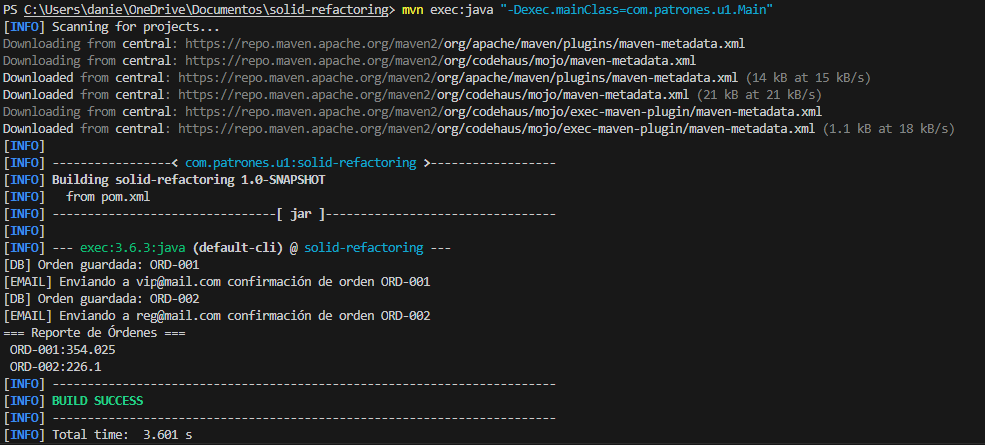

# Laboratorio SOLID – Refactorización de Sistema de Órdenes

## Descripción
Este proyecto corresponde a un laboratorio de refactorización de código aplicando los principios **SOLID** en Java.  
El sistema original contenía múltiples responsabilidades en una sola clase (`OrderProcessor`), lo que dificultaba su mantenimiento y extensión.

Durante el laboratorio se realizó una refactorización para mejorar la estructura del código aplicando los principios **SRP, OCP y DIP**.

El proyecto utiliza **Java** y **Maven** para la compilación y ejecución.

---

## Análisis de Violaciones SOLID

| Principio |                    Método/Sección afectada                           |     Descripción de la violación          |
|-----------|----------------------------------------------------------------------|------------------------------------------|
|    SRP    | calculateTotal + applyDiscount + saveOrder + sendEmail + printReport | La clase OrderProcessor tiene múltiples responsabilidades: cálculo de totales, aplicación de descuentos, persistencia de órdenes, envío de notificaciones y generación de reportes. Esto viola el principio de responsabilidad única, ya que una clase debería tener un solo motivo de cambio.       |
|    OCP    | applyDiscount (if/else sobre customerType)                           | El método aplica descuentos usando condicionales basados en el tipo de cliente. Si se agregan nuevos tipos de clientes o reglas de descuento, el método debe modificarse, lo cual viola el principio de abierto/cerrado.                                                                   |
|    DIP    | Toda la clase                                                        | La clase depende directamente de implementaciones concretas como System.out y la estructura interna de almacenamiento de órdenes. No utiliza abstracciones ni interfaces, lo que genera alto acoplamiento y dificulta la extensión o el reemplazo de componentes.                           |

---

# Estructura del Proyecto

solid-refactoring
│
├── pom.xml
├── README.md
│
└── src
└── main
└── java
└── com
└── patrones
└── u1
├── Main.java
├── OrderService.java
├── TaxCalculator.java
├── OrderRepository.java
├── EmailNotifier.java
├── OrderReporter.java
├── DiscountStrategy.java
├── VipDiscount.java
├── RegularDiscount.java
└── NoDiscount.java

---

# Instrucciones de Ejecución

### 1. Clonar el repositorio
git clone https://github.com/DanielSoplw/bautista-post1-u1.git

### 2. Entrar al proyecto
cd bautista-post1-u1

### 3. Compilar con Maven
mvn clean compile

### 4. Ejecutar el programa
mvn exec:java "-Dexec.mainClass=com.patrones.u1.Main"

---

# Funcionamiento del Sistema

El programa simula el procesamiento de órdenes para distintos tipos de clientes:

- Cliente **VIP**
- Cliente **Regular**

Cada orden realiza los siguientes pasos:

1. Cálculo del total
2. Aplicación del descuento según el tipo de cliente
3. Cálculo de impuestos
4. Guardado de la orden en el repositorio
5. Envío de notificación por email
6. Generación de reporte final

---

# Resultados

Ejemplo de salida del programa:

[DB] Orden guardada: ORD-001
[EMAIL] Enviando confirmación a vip@mail.com

[DB] Orden guardada: ORD-002
[EMAIL] Enviando confirmación a reg@mail.com

=== Reporte de Órdenes ===
ORD-001
ORD-002

---

# Evidencia de Ejecución

---

# Autor

Daniel Eduardo Bautista Pacheco  
Código: 1152389